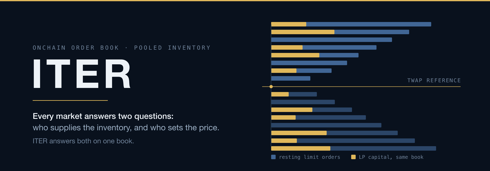

  

  <picture>
    <source media="(prefers-color-scheme: light)" srcset="assets/iter-banner-light.png" />
    
  </picture>

**A fully onchain central limit order book, with permissionless liquidity resting on it.**

---

## Every market answers two questions

Every trading venue — onchain or not — has to solve two problems that are easy to
conflate but genuinely separate:

- **Inventory** — who supplies the assets available to trade against, and who bears the
  risk of holding them while prices move?
- **Settlement** — given a desire to trade, how is the execution price determined, and how
  is the trade actually carried out?

DeFi has only ever answered one well at a time. Constant-product AMMs answered both at
once with a single bonding curve: the curve *is* the inventory and *is* the pricing rule,
so an LP has no way to say "I won't sell below this price." Concentrated liquidity loosened
that, but a v3 position still transacts at whatever the curve computes once price enters
its range. Order books answer settlement the way every mature financial market does — with
explicit, price-prioritised quotes — but historically hand inventory back to professional
market makers operating through a venue that hosts the book.

**ITER answers both on one book.**

## How it works

- **Settlement is a fully onchain CLOB.** `MatchingEngine.sol` + `Orderbook.sol` run an
  8-decimal fixed-point order queue with a per-pair matching discipline chosen at listing
  time — size-priority or strict price-time priority. Nothing about pricing is implied by a
  curve; a resting order is an exact declared price and size.

- **Inventory is pooled, and it rests on that same book.** `Pool.sol` turns permissionless
  LP capital into *ordinary limit orders* on the CLOB — not a second settlement primitive
  beside it. A position is a price range plus a `slippageLimit`: the LP's own declared
  tolerance. At swap time the pool assembles in-range positions tightest-tolerance-first
  and submits both legs to the same matching engine everyone else trades against.

- **An LP's downside is bounded by their own signature.** Execution is bounded to
  `TWAP × (1 ± slippageLimit)`. `slippageLimit = 0` is valid and means *only ever at the
  reference price* — the structural answer to being the counterparty that validates a price
  nobody should have accepted.

- **The reference price is time-weighted, not spot.** Pricing pool trades against
  `Orderbook.twap` rather than the last matched price is the load-bearing MEV mitigation,
  not an incidental choice.

- **Unfilled demand becomes supply.** Because settlement decomposes a trade into a
  matched-now portion and a remainder, a partial fill still settles what it can and the rest
  can rest as the trader's own order — deepening the book a swap draws from, rather than
  reverting the way an all-or-nothing AMM route does.

## What we measured — and what it costs

Every number below comes from a dependency-free simulation released alongside the paper,
and every one has a stated cost. Both halves are the point.

| Claim | Result | The cost, stated |
|---|---|---|
| Impermanent loss is bounded by construction | 0.00% at `slippageLimit = 0`, −0.0013% at the widest tier tested, against −5.7% (v2) and −2.8% (v3) at a 2× price move | Occasional **partial fills** when tolerant in-range liquidity runs thin |
| Same-block reference-price manipulation is damped | ~667× damping from the TWAP window; in the largest victim trade modelled, sandwich profit falls from ~$1,700 undamped to ~$2.55 — negative once the attacker pays their own gas | A **gas premium** over curve settlement |
| A pool swap is more expensive than a curve swap | 717,574 gas measured vs. ~120k for a v2 swap | Break-even around **$5,000** of trade size at 30 gwei / $3,000 ETH, and around **$500** on cheap L2 blockspace |

And the finding we are most willing to show — one against our own deployment: the
simulation caught that `Pool.sol` **as currently wired** still charges the LP leg the 10bps
maker fee and rebates a `poolFeeShare` that defaults to zero onchain, which makes the safest
possible position (`slippageLimit = 0`) realise **−$1,000 per $1M matched** rather than the
strictly-positive economics the intended fee design calls for. We found it by modelling
ourselves, and it is written down in the paper rather than around it.

## Read the work

- **[The research repo](https://github.com/off-grid-money/off-grid-research)** — the
  long-form working paper (*Every Market Answers Two Questions*), the condensed ACM
  submission, the simulation that produces every figure above, and the ETHTokyo 2026 talk
  materials.
- **[The contracts](https://github.com/standarddotim/standard3.0-contracts)** — the code the
  paper cites by line number.

No token. No pitch. The paper, the simulations, and the numbers that go against us are
published so they can be read, checked, and argued with.

---

*First-principles market design. Claims stated with their costs. Long-term system design.*
