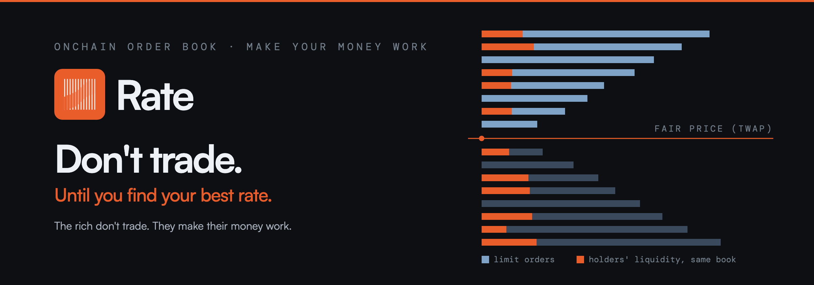

  <picture>
    <source media="(prefers-color-scheme: light)" srcset="assets/rate-banner-light.png" />
    
  </picture>

**Don't trade. Until you find your best rate.**

---

## The rich don't trade. They make their money work.

Most of crypto is built to make you trade more: perps, leverage, points for volume.
Every extra trade is a fee someone else collects. The evidence has been in for a long time:

- Of 66,465 US households, those that traded most earned **11.4%** a year while the market
  returned **17.9%** (Barber & Odean, [*Trading Is Hazardous to Your Wealth*](https://onlinelibrary.wiley.com/doi/abs/10.1111/0022-1082.00226), 2000).
- Of people who day-traded Brazilian equity futures for more than 300 days, **97% lost money**
  (Chague, De-Losso & Giovannetti, [*Day Trading for a Living?*](https://papers.ssrn.com/sol3/papers.cfm?abstract_id=3423101), 2019).

Wealth is built the other way: by putting money to work. Rate pays you for yours: provide liquidity, and the traders on the other side pay you the fee.

## Get paid to hold

A liquidity provider is the other side of every trade. On most DEXs that side gets a bad deal:
a curve sells to anyone at a price it can't refuse, and the LP eats the difference. On Rate you
are that side on your own terms.

- **Bring the token you already own.** A one-token deposit swaps nothing: no fee to get in,
  no price moved against you, no counterparty needed. Your token rests in a band ladder as
  inventory.
- **Set your rate.** Each band fills only at the pool's time-weighted anchor price, give or
  take a tolerance bounded by the pair's slippage limit. There is no curve selling cheap to
  whoever arrives first.
- **Traders pay the fee. Holders collect it.** Traders who convert your inventory pay the
  fee to the band's LPs. Fees vest over time, so patient capital earns in full and
  hit-and-run liquidity doesn't.

And when you do trade, trade at your rate: every fill on an open onchain order book, at a
price you chose, self-custody the whole way.

## Launch for holders, not flippers

Create a token on the same book everyone trades on, two ways:

- **Launch now.** The coin's supply is minted once: no mint function, no owner. It is
  listed on the order book in the same transaction.
- **Run an auction.** One price, set by the creator, for every buyer: no bonding curve and
  no sniping race. An oversubscribed sale fills everyone pro-rata and refunds the rest; a sale
  under its minimum refunds everyone in full. At least 20% of the raise becomes liquidity
  that stays locked for a period the sale sets, and the creator's own tokens vest. If anyone
  lists the token before the sale graduates, the sale fails and every buyer is refunded.

## Multichain

One protocol, deployed natively on each chain: the same order book, the same launchpad and
the same holder-first liquidity. One portfolio and one Explore view span every chain, and one
profile follows your wallet everywhere.

| Chain | Chain ID | Gas | Status |
|---|---|---|---|
| RISE Testnet | 11155931 | ETH | Live (testnet) |
| Arc Testnet | 5042002 | USDC | Live (testnet) |

A chain is added once its contracts are deployed and verified. The live list is on
[rate.limo](https://rate.limo).

## How it works

- **Settlement is a fully onchain CLOB.** `MatchingEngine.sol` + `Orderbook.sol` run an
  8-decimal fixed-point order queue. A resting order is an exact declared price and size;
  nothing about pricing is implied by a curve.
- **Inventory is pooled, and it rests on that same book.** `BandPool.sol` holds LP capital
  in a ladder of bands; `BandPositionManager.sol` gives each position one ERC-1155 token
  holding its whole ladder: the distribution, the fee checkpoints and one vesting clock.
- **The reference price is time-weighted, not spot.** Bands price against a 300-second TWAP
  anchor, and every pool print is clamped to the pair's rail before it reaches that anchor.
  That is the load-bearing MEV mitigation, not an incidental choice.
- **Unfilled demand becomes supply.** A swap settles what the book can fill now; the
  remainder can rest as the trader's own order or as liquidity, deepening the book the next
  swap draws from.

## What we've measured, and what we haven't

The research repo carries a dependency-free simulation. In it, an LP whose fills are bounded
to the reference price ± its own tolerance ends a 2× price move within **0.0013%** of simply
holding, against **−5.7%** for Uniswap v2 and **−30.7%** for a ±10% v3 range. Two honest
caveats:

- That model was written for `Pool.sol`, the generation retired in September 2026. Band pools
  keep the same fill bound, but **they have not been re-simulated yet**, so treat the figure as
  the previous design's.
- Bounded fills are not "no risk". If the price leaves your bands you end up holding the
  other token. That is exposure, and it is real.

The same simulation caught a flaw against our own deployment of the time: `Pool.sol` charged
the LP leg the maker fee while its rebate defaulted to zero, which made the safest position
lose money. We found it by modelling ourselves and wrote it into the paper instead of around it.

## Read the work

- **[The research repo](https://github.com/rate-limo/rate-research)**: the working paper
  (*Every Market Answers Two Questions*), the simulation behind every figure above, and the
  ETHTokyo 2026 talk materials.
- **[The contracts](https://github.com/rate-limo/rate-contracts)**: the code the paper cites,
  including `AssetGenerator.sol` and `PresaleLaunch.sol` for launches.

Rate runs on testnet today. Nothing here is investment advice.

---

*Don't trade. Until you find your best rate.*
